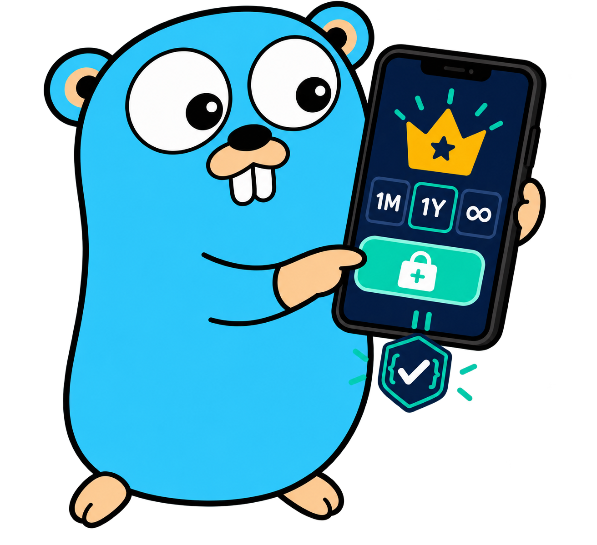

<p align="center">
  
</p>

<h1 align="center">IAPStack</h1>

<p align="center">
  Open-source, self-hosted in-app purchase verification and entitlement infrastructure.
  <br>
  Built in Go. Store-agnostic. Deployable anywhere.
</p>

<p align="center">
  <a href="LICENSE"></a>
  
  
</p>

> [!IMPORTANT]
> IAPStack is in early development and is not ready for production use yet.

IAPStack is a self-hosted control plane for validating in-app purchases and turning store transactions into durable application entitlements. It is designed for teams that want one backend-owned model across mobile stores without handing their purchase data or access rules to a hosted subscription platform.

## What IAPStack aims to provide

- Server-side verification for subscriptions, consumables, non-consumables, and lifetime purchases
- A store-neutral transaction and entitlement model
- Customer identity, aliases, restore flows, and migration support
- Store notification ingestion and lifecycle reconciliation
- Signed outbound webhooks for application backends
- An operational dashboard for customers, products, transactions, and entitlements
- First-party SDKs, beginning with Flutter
- Docker-first deployment backed by PostgreSQL

## Design principles

**Self-hosted by default.** You own the infrastructure, credentials, purchase data, and access decisions.

**Stores are adapters.** Store-specific APIs remain isolated behind shared contracts; the core domain does not depend on a single marketplace.

**Entitlements are the product boundary.** Applications ask what a customer can access instead of interpreting raw receipts or store states.

**Deploy anywhere.** The target is a straightforward container deployment rather than dependence on a particular cloud platform.

**Independent implementation.** Official store documentation defines behavior and security requirements. Other open-source projects may be studied for interoperability and edge cases, while IAPStack's code is implemented independently.

## Planned architecture

```text
.
├── cmd/iapstack/          # API and worker entrypoints
├── internal/
│   ├── core/              # Customers, transactions, products, and entitlements
│   └── stores/            # Apple, Google, Huawei, Amazon, and future adapters
├── dashboard/             # Self-hosted web dashboard
├── sdks/                  # Flutter and future client SDKs
├── contracts/             # Public API and webhook contracts
└── deploy/                # Docker and deployment templates
```

## Roadmap

- [ ] Define the core domain, public API contracts, and persistence model
- [ ] Implement the Huawei AppGallery adapter from official specifications
- [ ] Add PostgreSQL migrations and a production-ready Docker setup
- [ ] Build the initial dashboard and Flutter SDK
- [ ] Add Apple App Store and Google Play adapters
- [ ] Add Amazon Appstore and additional store adapters
- [ ] Support customer migration, reconciliation, and signed outbound webhooks
- [ ] Publish the first stable release and production hardening guide

The order above describes the initial implementation sequence, not a limitation of the architecture. IAPStack is intended to treat every store as a first-class adapter.

## License

Licensed under the [Apache License 2.0](LICENSE).
